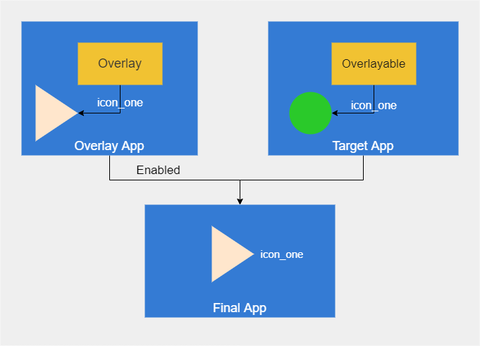

# Car UI Library

+ What can customization
   + Components --> Java classes that implement a specific behavior. For example, CarUiRecyclerView and Toolbar 
   + Resources  --> Individual Android resources that represent the knobs available for OEMs to achieve consistency with their own design. The components above use these resources to become customizable   
+ How to customization 
   + TargetApp to integrate the Car UI Library
   + Build-time overlays for build AAOS
   + OverlayApp use dynamic runtime overlays (dynamic RRO)
   + OverlayApp use static runtime overlays (static RRO)

## How to customization

### [Build-time overlays](https://source.android.com/devices/automotive/hmi/car_ui/customize)

This customization is applied at Android system image build time. During the build, all apps in the system receive resources from their res folder and from overlay folders defined in the target makefiles.

### [Resource Overlays (RROs)](https://source.android.com/devices/architecture/rros)

* **OverLayApk**

Define the ***overlay*** resource map: The following code shows an example res/xml/overlays.xml file.
~~~
<?xml version="1.0" encoding="utf-8"?>
<overlay xmlns:android="http://schemas.android.com/apk/res/android" >
    <!-- Overlays string/config1 and string/config2 with the same resource. -->
    <item target="string/config1" value="@string/overlay1" />
    <item target="string/config2" value="@string/overlay1" />

    <!-- Overlays string/config3 with the string "yes". -->
    <item target="string/config3" value="@android:string/yes" />

    <!-- Overlays string/config4 with the string "Hardcoded string". -->
    <item target="string/config4" value="Hardcoded string" />

    <!-- Overlays integer/config5 with the integer "42". -->
    <item target="integer/config5" value="42" />
</overlay>
~~~
And link the resource map:
~~~
<manifest xmlns:android="http://schemas.android.com/apk/res/android"
    package="com.example.overlay">
    <application android:hasCode="false" />
    <overlay android:targetPackage="com.example.target"
                   android:targetName="OverlayableResources"
                   android:resourcesMap="@xml/overlays"/>
</manifest>
~~~

* **TargetApk**
  
Define ***overlayable*** in the following example res/values/overlayable.xml file
~~~
<!-- The collection of resources for theming the appearance of the device -->
<overlayable name="ThemeResources">
       <policy type="public">
               <item type="string" name="foo/" />
               <item type="integer" name="bar/" />
       </policy>
       ...
</overlayable>
~~~

Use the “policy” tag to enforce restrictions on overlayable resources. The type attribute specifies which policies an overlay must fulfill to override the included resources. Supported types include the following.

- public. Any overlay can override the resource.
- system. Any overlay on the system partition can override the resources.
- vendor. Any overlay on the vendor partition can override the resources.
- product. Any overlay on the product partition can override the resources.
- signature. Any overlay signed with the same signature as the target APK can override the resources.

>  If the target package doesn't have a defined overlayable, the overlay must be preinstalled on the system image or signed with the same signature as the target to overlay the target package's resources.

