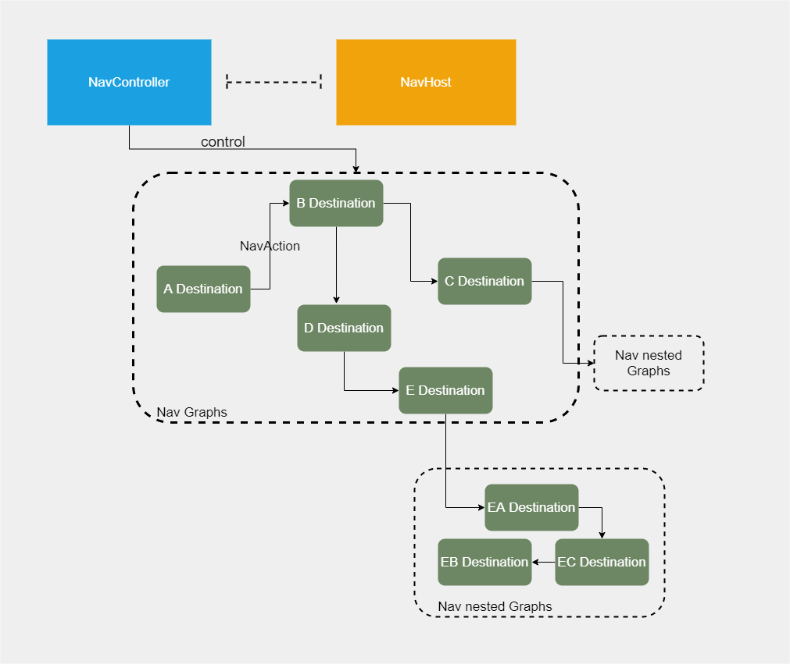
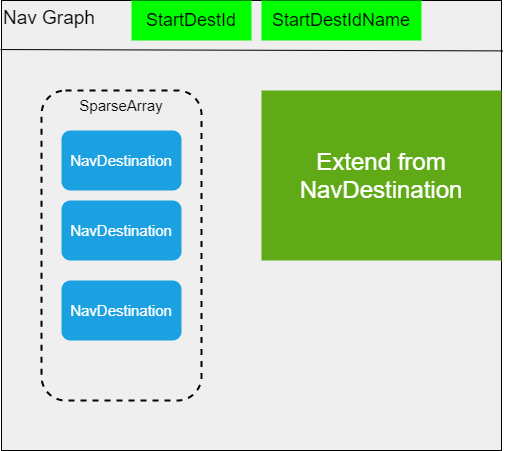
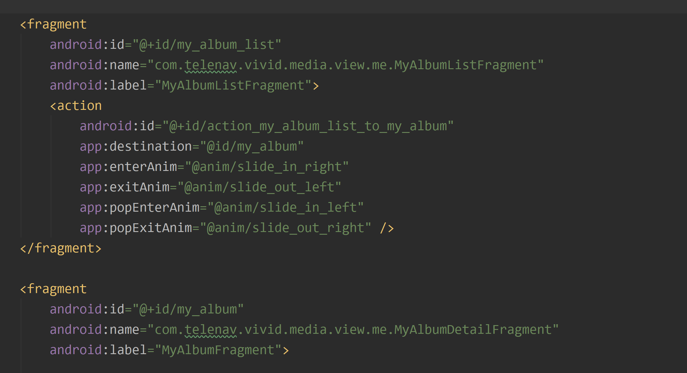
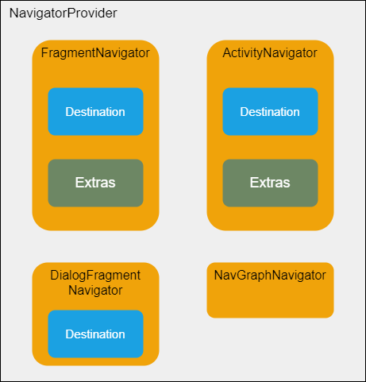
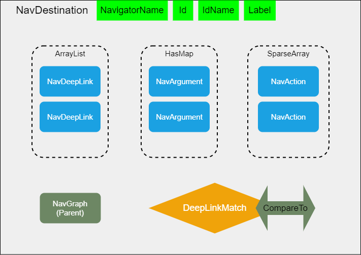
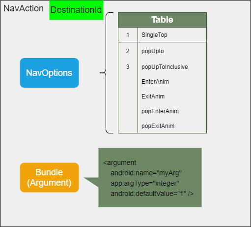
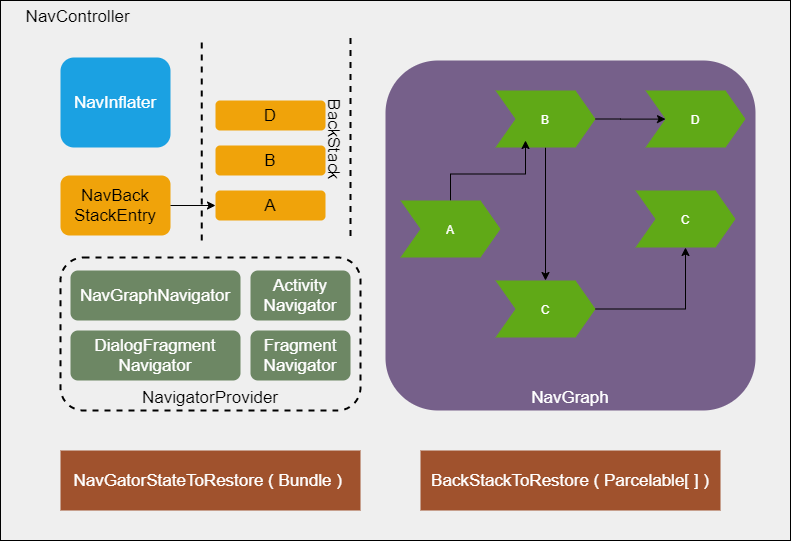

# Jetpack 之 Navigation

## Navigation 初体验

Navigation 是 Google 官方提出的关于页面跳转的新设计，关于 Navigation 的链接: https://developer.android.com/guide/navigation , 其中提到了是三个关键性的东西：
+ Navigation graph
+ NavHost
+ NavController
  
其中 NavHost 和 NavController 一一对应，NavController 作为管理页面的跳转的大脑，NavHost 作为一个基础承载了页面的切换场所。而 NavGraph 描述了页面切换的 Flow。
下面会通过这三个元素引申出更多的元素。

## Navigation 的元素

+ ### ***NavGraph*** 
先看一下下面这幅图：

其中 NavGraph 代表了一个连贯的跳转目的地的集合，它是继承自 NavDestination。其中有一个稀疏数组存储了所有的 NavDestination。NavGraph 中有一个 int 类型的 StartDestId 以及 String 类型的 StartDestIdName，是用于跳转到某个 NavGraph 的时候，显示第一个 Destination。而 Destination 的定义如下。
NavGraph 可以通过 AndroidStudio 的 Navigation Edit 来编辑，同时也可以直接编写 XML。

+ ### ***NavDestination*** 
NavDestination 代表跳转的目的地，它有四个子类，分别是 Fragment 相关的 Destination，Activity 相关的 Destination，以及 DialogFragment 相关可以浮在其他 Destination 的 Destination，还有就是上面提到的 NavGraph。这里就以 fragment 相关的 Destination 作一个栗子，这里的 fragment 相关的 Destination 是 FragmentNavigator 的静态内部类如下：
~~~
@Navigator.Name("fragment")
public class FragmentNavigator extends Navigator<FragmentNavigator.Destination> {
    @NavDestination.ClassType(Fragment.class)
    public static class Destination extends NavDestination {

        private String mClassName;

        public Destination(@NonNull NavigatorProvider navigatorProvider) {
            this(navigatorProvider.getNavigator(FragmentNavigator.class));
        }

        public Destination(@NonNull Navigator<? extends Destination> fragmentNavigator) {
            super(fragmentNavigator);
        }

        @CallSuper
        @Override
        public void onInflate(@NonNull Context context, @NonNull AttributeSet attrs) {
            super.onInflate(context, attrs);
            TypedArray a = context.getResources().obtainAttributes(attrs,
                    R.styleable.FragmentNavigator);
            String className = a.getString(R.styleable.FragmentNavigator_android_name);
            if (className != null) {
                setClassName(className);
            }
            a.recycle();
        }

        ...
    }
}

~~~
其中有一句比较关键的代码，可以看到这里的 className 就是特定的 Fragment 的 Name。当然对于不同的 Navigator，这里的 className 代表不同的含义:
~~~
String className = a.getString(R.styleable.FragmentNavigator_android_name);
~~~
这里添加一幅图来了解一些 Navigator:

Navigator 是跳转器真正的负责某种类型的 Destination 跳转。

这里也要讲解一下 NavDestination 的基类构造：我先用一幅图片来展示一下：

NavDestination 拥有一个 int 类型的 Id，一个 String 类型的 IdName，一个 String 类型的 NavigationName。这些属性是从 navigation.xml 里的节点解析出来的。NavDestination 还包含了指向父节点 (NavGraph) 的引用。其中还有一个以 NavAction 为 item 所组成的稀疏列表，包括了这个目的地到其他目的地的情况。下文会有解释。
同时还拥有一个 HasMap 来存储一些对于跳转到此目的地所携带的参数信息，这里需要注意一点，这个参数信息是这个目的地所需要的。NavAction 同时也有自己的参数信息，这个是跳转到指定目的地的时候携带的参数信息。同时 NavDestination 还拥有一个 ArrayList 的 NavDeepLink，代表这个目的地支持的所有 DeepLink。

+ ### ***NavAction***

如果把整个 Navigation 比作一张图的跳转。图上每一个节点代表一个 NavDestination，而两个节点之间的联系，就是所谓的 NavAction。这里我先添加一幅照片：

每个 NavAction 有能力携带一些参数，同时可以通过设置 NavOptions 来配置 NavAction。达到配置 Destination 切换的动画，回退清栈等等。

+ ### ***NavController***

NavController 是控制跳转目的地的中央控制器，其中 NavInflater 是把 navigation.xml 解析成 NavGraph，在解析过程中需要 Navigator 的配合。当程序中触发了跳转目的地的操作，就会给 NavDestination 创建对应的 NavBackStackEntry 然后添加到一个通过双向队列实现的 BackStack 中。接着会调用 NavDestination 所属的 Navigator 的 navigate 方法来作具体的跳转，比如 FragmentNavigator 就会通过 FragmentManager 来切换Fragment。 如果跳转的目的地横跨了两个 Navigator，就会需要 NavigatorStateToRestore 以及 BackStackToRestore 来存储状态。

+ ### ***NavHost***

在 navigation 源码中 NavHost 是一个接口：
~~~
public interface NavHost {

    /**
     * Returns the {@link NavController navigation controller} for this navigation host.
     *
     * @return this host's navigation controller
     */
    @NonNull
    NavController getNavController();
}
~~~
其实现类是 NavHostFragment，在其 onCreate 方法中创建了 NavHostController ( NavController 子类)。具体的实现可以查看源码。
~~~
public class NavHostFragment extends Fragment implements NavHost {
    ...
    @CallSuper
    @Override
    public void onCreate(@Nullable Bundle savedInstanceState) {
        super.onCreate(savedInstanceState);
        final Context context = requireContext();

        mNavController = new NavHostController(context);
        mNavController.setLifecycleOwner(this);
        mNavController.setOnBackPressedDispatcher(requireActivity().getOnBackPressedDispatcher());
        // Set the default state - this will be updated whenever
        // onPrimaryNavigationFragmentChanged() is called
        mNavController.enableOnBackPressed(
                mIsPrimaryBeforeOnCreate != null && mIsPrimaryBeforeOnCreate);
        mIsPrimaryBeforeOnCreate = null;
        mNavController.setViewModelStore(getViewModelStore());
        onCreateNavController(mNavController);

       ...
    }
    ...
}
~~~