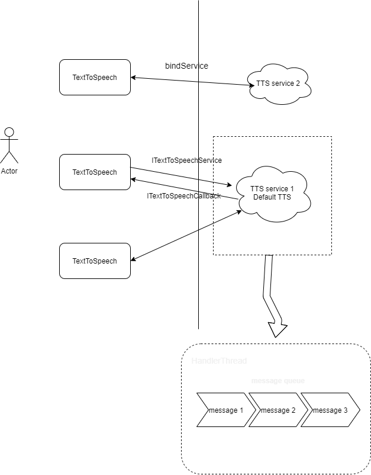
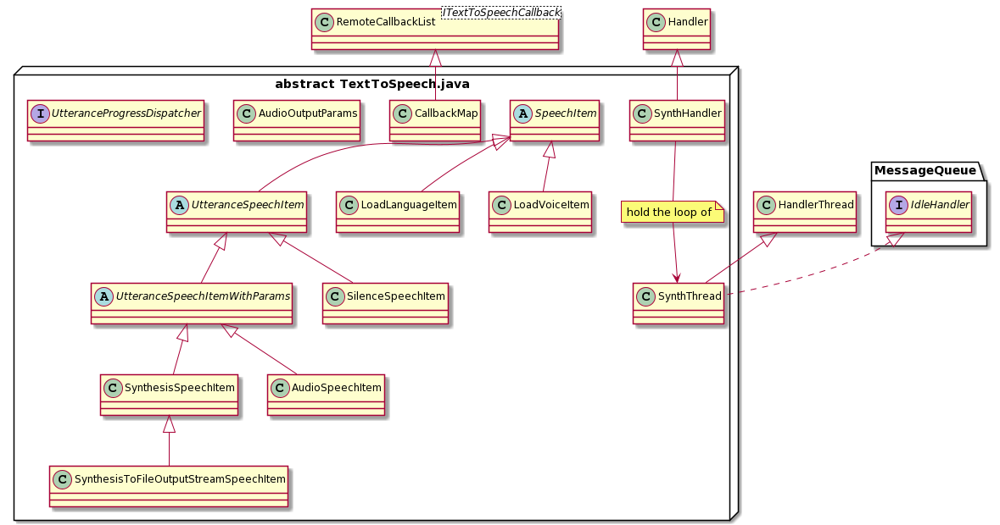

# Android TTS Service

Android TTS Service base structure：

The tts user will bind the TextToSpeechService and then invoke the speak api to speech the voice.
TextToSpeechService use Threadhandler to keep and process the speak item.

## TextToSpeech
The Android TextToSpeech init method initTts():

Step 1: Try connecting to the engine that was requested.
~~~
        if (mRequestedEngine != null) {
          if (mEnginesHelper.isEngineInstalled(mRequestedEngine)) {
              if (connectToEngine(mRequestedEngine)) {
                  mCurrentEngine = mRequestedEngine;
                  return SUCCESS;
              } else if (!mUseFallback) {
                   mCurrentEngine = null;
                   dispatchOnInit(ERROR);
                   return ERROR;
              }
          } else if (!mUseFallback) {
               Log.i(TAG, "Requested engine not installed: " + mRequestedEngine);
              mCurrentEngine = null;
              dispatchOnInit(ERROR);S
              return ERROR;
          }
       }
        
~~~

Step 2: Try connecting to the user's default engine.
~~~
        final String defaultEngine = getDefaultEngine();
        if (defaultEngine != null && !defaultEngine.equals(mRequestedEngine)) {
            if (connectToEngine(defaultEngine)) {
                mCurrentEngine = defaultEngine;
                return SUCCESS;
            }
        }

~~~
Step 3: Try connecting to the highest ranked engine in the
system.
~~~
        final String highestRanked = mEnginesHelper.getHighestRankedEngineName();
        if (highestRanked != null && !highestRanked.equals(mRequestedEngine) &&
                !highestRanked.equals(defaultEngine)) {
            if (connectToEngine(highestRanked)) {
                mCurrentEngine = highestRanked;
                return SUCCESS;
            }
        }

        mCurrentEngine = null;
        dispatchOnInit(ERROR);
        return ERROR;
    
~~~
The connectToEngine(xxEngine) is the method to connect to TTS Service. Show as below:

~~~
    private boolean connectToEngine(String engine) {
        Connection connection = new Connection();
        Intent intent = new Intent(Engine.INTENT_ACTION_TTS_SERVICE);
        intent.setPackage(engine);
        boolean bound = mContext.bindService(intent, connection, Context.BIND_AUTO_CREATE);
        if (!bound) {
            Log.e(TAG, "Failed to bind to " + engine);
            return false;
        } else {
            Log.i(TAG, "Sucessfully bound to " + engine);
            mConnectingServiceConnection = connection;
            return true;
        }
    }
~~~
The request aidl interface from TextToSpeech to TextToSSpeechService is like below: 
~~~
interface ITextToSpeechService {

    /**
     * Tells the engine to synthesize some speech and play it back.
     */
    int speak(in IBinder callingInstance, in CharSequence text, in int queueMode, in Bundle params,
            String utteranceId);

    /**
     * Tells the engine to synthesize some speech and write it to a file.
     */
    int synthesizeToFileDescriptor(in IBinder callingInstance, in CharSequence text,
        in ParcelFileDescriptor fileDescriptor, in Bundle params, String utteranceId);

    /**
     * Plays an existing audio resource.
     */
    int playAudio(in IBinder callingInstance, in Uri audioUri, in int queueMode, in Bundle params,
            String utteranceId);

    /**
     * Plays silence.
     */
    int playSilence(in IBinder callingInstance, in long duration, in int queueMode,
        in String utteranceId);

    /**
     * Checks whether the service is currently playing some audio.
     */
    boolean isSpeaking();

    /**
     * Interrupts the current utterance (if from the given app) and removes any utterances
     * in the queue that are from the given app.
     */
    int stop(in IBinder callingInstance);

    /**
     * Returns the language, country and variant currently being used by the TTS engine.
     * Can be called from multiple threads.
     */
    String[] getLanguage();

    /**
     * Returns a default TTS language, country and variant as set by the user.
     *
     * Can be called from multiple threads.
     */
    String[] getClientDefaultLanguage();

    /**
     * Checks whether the engine supports a given language.
     */
    int isLanguageAvailable(in String lang, in String country, in String variant);

    /**
     * Returns a list of features available for a given language. Elements of the returned
     */
    String[] getFeaturesForLanguage(in String lang, in String country, in String variant);

    /**
     * Notifies the engine that it should load a speech synthesis language.
     */
    int loadLanguage(in IBinder caller, in String lang, in String country, in String variant);

    /**
     * Sets the callback that will be notified when playback of utterance from the
     */
    void setCallback(in IBinder caller, ITextToSpeechCallback cb);

    /**
     * Get the array of available voices.
     */
    List<Voice> getVoices();

    /**
     * Notifies the engine that it should load a speech synthesis voice.
     *
     */
    int loadVoice(in IBinder caller, in String voiceName);

    /**
     * Return a name of the default voice for a given locale.
     */
    String getDefaultVoiceNameFor(in String lang, in String country, in String variant);
}

~~~
Pay attention that the speak method is asynchronous, the method just adds the request to the queue of TTS requests and then returns. And the queueMode has three type:
> QUEUE_FLUSH 

  "Queue mode where all entries in the playback queue (media to be played
  and text to be synthesized) are dropped and replaced by the new entry.
  Queues are flushed with respect to a given calling app. Entries in the queue
  from other callees are not discarded."
  
> QUEUE_ADD

  "Queue mode where the new entry is added at the end of the playback queue."

> QUEUE_DESTROY

"Queue mode where the entire playback queue is purged. This is different
from {@link #QUEUE_FLUSH} in that all entries are purged, not just entries
from a given caller."
~~~
speak(final CharSequence text,
                     final int queueMode,
                     final Bundle params,
                     final String utteranceId)
~~~ 
And the response aild interface from the TextToSpeechService to TextToSpeech is like below: 
~~~
oneway interface ITextToSpeechCallback {
    /**
     * Tells the client that the synthesis has started playing.
     */
    void onStart(String utteranceId);

    /**
     * Tells the client that the synthesis has finished playing.
     */
    void onSuccess(String utteranceId);

    /**
     * Tells the client that the synthesis was stopped.
     */
    void onStop(String utteranceId, boolean isStarted);

    /**
     * Tells the client that the synthesis has failed.
     */
    void onError(String utteranceId, int errorCode);

    /**
     * Tells the client that the TTS engine has started synthesizing the audio for a request.
     */
    void onBeginSynthesis(String utteranceId, int sampleRateInHz, int audioFormat, int channelCount);

    /**
     * Tells the client about a chunk of the synthesized audio.
     */
    void onAudioAvailable(String utteranceId, in byte[] audio);

    /**
     * Tells the client that the engine is about to speak the specified range of the utterance.
     */
    void onRangeStart(String utteranceId, int start, int end, int frame);
}
~~~
The TextToSpeech class diagram is below:

## TextToSpeechService

The TextToSpeechService is abstract class and the tts provider will extends it. And implement the abstract function:

~~~
    protected abstract int onIsLanguageAvailable(String lang, String country, String variant);
    protected abstract String[] onGetLanguage();
    protected abstract int onLoadLanguage(String lang, String country, String variant);
    protected abstract void onStop();
    protected abstract void onSynthesizeText(SynthesisRequest request, SynthesisCallback callback);

~~~

> The onIsLanguageAvailable method checks whether the engine supports a given language, 

> The onGetLanguage return the the language, country and variant currently provider TTS Engine used.

> The onLoadLanguage notifies the engine that it should load a speech synthesis language.

> The onStop notifies the service that it should stop any in-progress speech synthesis.

> The onSynthesizeText tells the service to synthesize speech from the given text

The class diagram is :

And the service open a new handlerThread to process the speech request, And use SpeechItem represent the request to add to the queue with queueMode, as mentioned above.

And the process request logic is playImpl() in SpeechItem, Use SynthesisSpeechItem as example: 
~~~
        @Override
        protected void playImpl() {
            AbstractSynthesisCallback synthesisCallback;
            mEventLogger.onRequestProcessingStart();
            synchronized (this) {
                // stop() might have been called before we enter this
                // synchronized block.
                if (isStopped()) {
                    return;
                }
                mSynthesisCallback = createSynthesisCallback();
                synthesisCallback = mSynthesisCallback;
            }

            TextToSpeechService.this.onSynthesizeText(mSynthesisRequest, synthesisCallback);

            // Fix for case where client called .start() & .error(), but did not called .done()
            if (synthesisCallback.hasStarted() && !synthesisCallback.hasFinished()) {
                synthesisCallback.done();
            }
        }
~~~

Finally through  onSynthesizeText(mSynthesisRequest, synthesisCallback) to invoke TTS Engine to speak the voice.